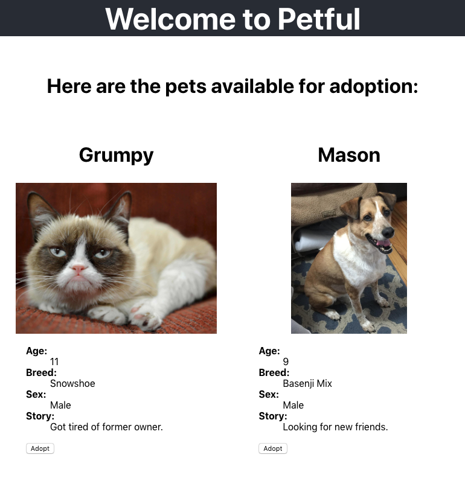

# Petful
> First-In, First-Out Pet Adoption

<!-- [![NPM Version][npm-image]][npm-url] -->
<!-- [](https://travis-ci.org/clintonowen/kando-mvp-client) -->
<!-- [![Downloads Stats][npm-downloads]][npm-url] -->

## [Live App](https://clint-petful-client.herokuapp.com/)
( Refresh page to reset pet data )

* Petful is an application for an animal shelter which allows adoption of cats and dogs. 
* The adoption process works strictly on a first in first out basis.
* People can adopt a cat or a dog or both—not by their choice but by the cat or dog who has been in the shelter the longest.



<!-- ## Installation

OS X & Linux:

```sh
npm install my-crazy-module --save
```

Windows:

```sh
edit autoexec.bat
``` -->

<!-- ## Usage example

A few motivating and useful examples of how your product can be used. Spice this up with code blocks and potentially more screenshots. -->

<!-- _For more examples and usage, please refer to the [Wiki][wiki]._ -->

## Technology Stack
**Front End**:
* React (via [create-react-app](https://github.com/facebook/create-react-app))
* Redux, Redux Thunk
* JavaScript
* HTML, CSS

**Back End** ([Server GitHub Repo](https://github.com/clintonowen/petful-server))
* Node
* Express

**Database**
* Dummy database using Queue data structure

**Deployment**
* Heroku

## Main Project Structure

```
petful-client/
├── node_modules/ (see "Development Setup")
├── public/
│   └── index.html (static markup)
├── src/
│   ├── actions/
│   ├── components/
│   │   └── Dashboard.js (top-level component)
│   ├── reducers/
│   ├── index.js (renders `Dashboard` to index.html)
│   └── store.js (Redux store)
├── package.json (NPM dependencies)
└── README.md
```

## Development setup

To clone the repo to your local development environment, execute the following commands (requires [Node](https://nodejs.org)).

```sh
# Clone the repo
git clone https://github.com/clintonowen/petful-client.git

# Move into the project directory
cd petful-client

# Install dependencies (in /node_modules/)
npm i

# Run the app:
npm start
```

<!-- ## Release History

* 0.2.1
    * CHANGE: Update docs (module code remains unchanged)
* 0.2.0
    * CHANGE: Remove `setDefaultXYZ()`
    * ADD: Add `init()`
* 0.1.1
    * FIX: Crash when calling `baz()` (Thanks @GenerousContributorName!)
* 0.1.0
    * The first proper release
    * CHANGE: Rename `foo()` to `bar()`
* 0.0.1
    * Work in progress -->

## Contributing

1. Fork it (<https://github.com/yourname/yourproject/fork>)
2. Create your feature branch (`git checkout -b feature/fooBar`)
3. Commit your changes (`git commit -am 'Add some fooBar'`)
4. Push to the branch (`git push origin feature/fooBar`)
5. Create a new Pull Request

## Meta

by Clinton Owen – [@CoderClint](https://twitter.com/CoderClint) │ clint@clintonowen.com │ [https://github.com/clintonowen](https://github.com/clintonowen)

<!-- Markdown link & img dfn's -->
[npm-image]: https://img.shields.io/npm/v/datadog-metrics.svg?style=flat-square
[npm-url]: https://npmjs.org/package/datadog-metrics
[npm-downloads]: https://img.shields.io/npm/dm/datadog-metrics.svg?style=flat-square
[travis-image]: https://img.shields.io/travis/dbader/node-datadog-metrics/master.svg?style=flat-square
[travis-url]: https://travis-ci.org/dbader/node-datadog-metrics
[wiki]: https://github.com/yourname/yourproject/wiki